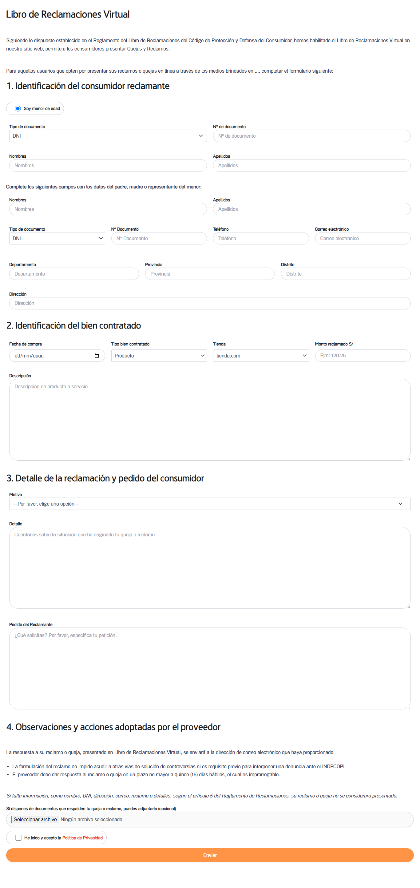

# Libro de Reclamaciones Virtual - WordPress

Este proyecto implementa un formulario de "Libro de Reclamaciones Virtual" en WordPress utilizando el plugin [Contact Form 7](https://wordpress.org/plugins/contact-form-7/) y el plugin [WPCode – Insert Headers and Footers + Custom Code Snippets – WordPress Code Manager](https://wordpress.org/plugins/insert-headers-and-footers/). A continuación se detallan los pasos para configurar el formulario.

## Requisitos Previos

- WordPress instalado y configurado.
- Compatible con tema Astra.
- Plugins necesarios:
  - [Contact Form 7](https://wordpress.org/plugins/contact-form-7/)
  - [WPCode - Insert Headers and Footers](https://wordpress.org/plugins/insert-headers-and-footers/)

## Instrucciones de Instalación

### Paso 1: Crear el formulario en Contact Form 7

1. Instala y activa el plugin Contact Form 7.
2. Ve a la opción **Contact** en el menú lateral de WordPress y selecciona **Añadir nuevo**.
3. Asigna al formulario el nombre **Libro de Reclamaciones Virtual**.
4. Inserta el código del formulario disponible en el archivo `index.html` desde `<!-- Inicio de Formulario -->` hasta `<!-- Fin de Formulario -->`. Puedes encontrar el código aquí: [index.html](index.html).
5. Guarda el formulario.
6. Copia el shortcode generado (por ejemplo, `[contact-form-7 id="1234" title="Libro de Reclamaciones Virtual"]`) y pégalo en la página donde deseas que aparezca el formulario.

### Paso 2: Insertar el JavaScript en WPCode

1. Instala y activa el plugin WPCode.
2. Ve al menú lateral y selecciona **WPCode** > **Insert Headers and Footers**.
3. En la sección **Footer**, inserta el código JavaScript disponible en el archivo `script.js`. Puedes encontrar el código aquí: [script.js](script.js).
4. Guarda los cambios.

### Paso 3: Insertar el CSS personalizado

1. Ve a **Apariencia** > **Personalización** > **CSS adicional**.
2. Inserta el código CSS disponible en el archivo `style.css`. Puedes encontrar el código aquí: [style.css](style.css).
3. Guarda los cambios.

## Demostración

## Pruebas y Compatibilidad

Este formulario ha sido probado con los siguientes elementos:

- **Tema**: [Astra](https://wordpress.org/themes/astra/)
- **Versión del Proyecto**: 1.0.0

## Licencia

Este proyecto está licenciado bajo la [GNU General Public License v3.0](https://www.gnu.org/licenses/gpl-3.0.html).

---

